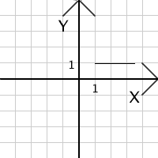
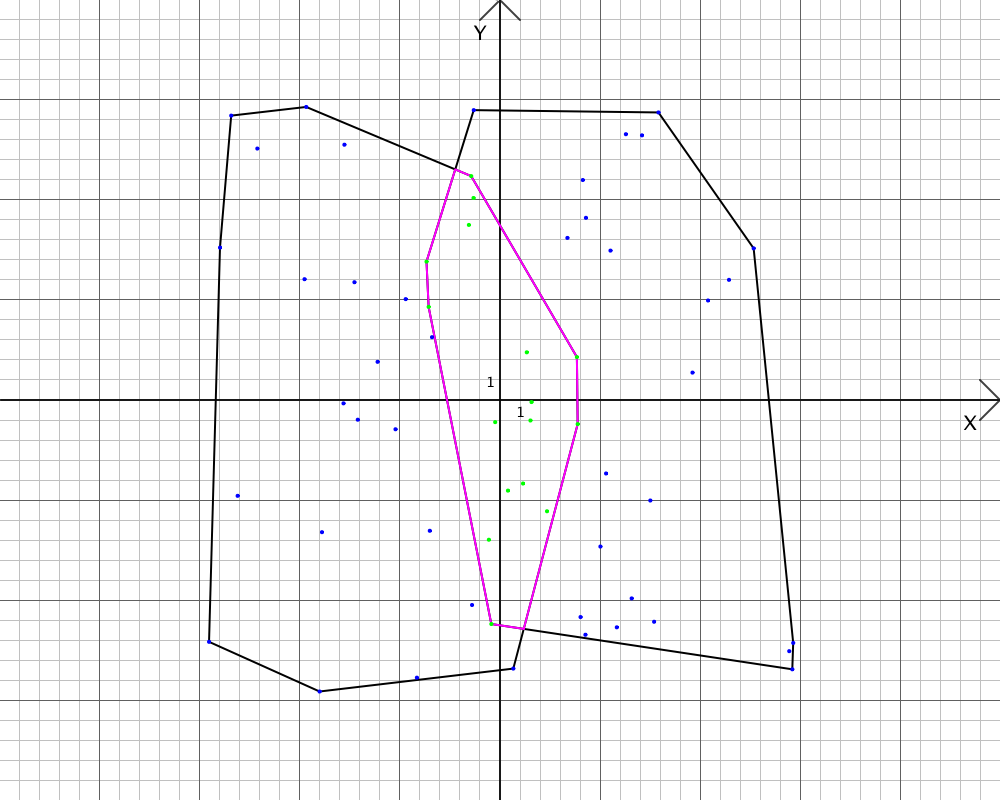
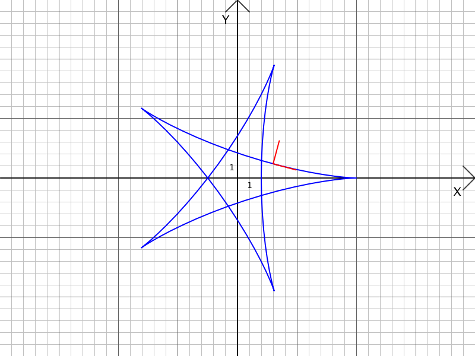
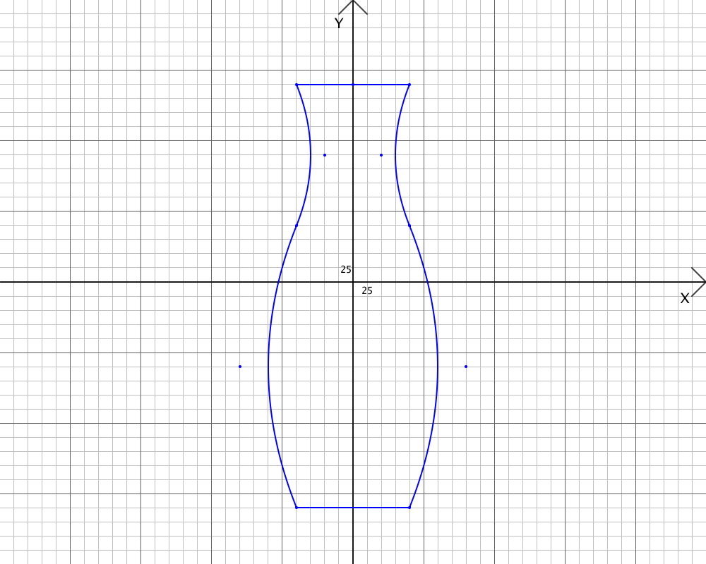
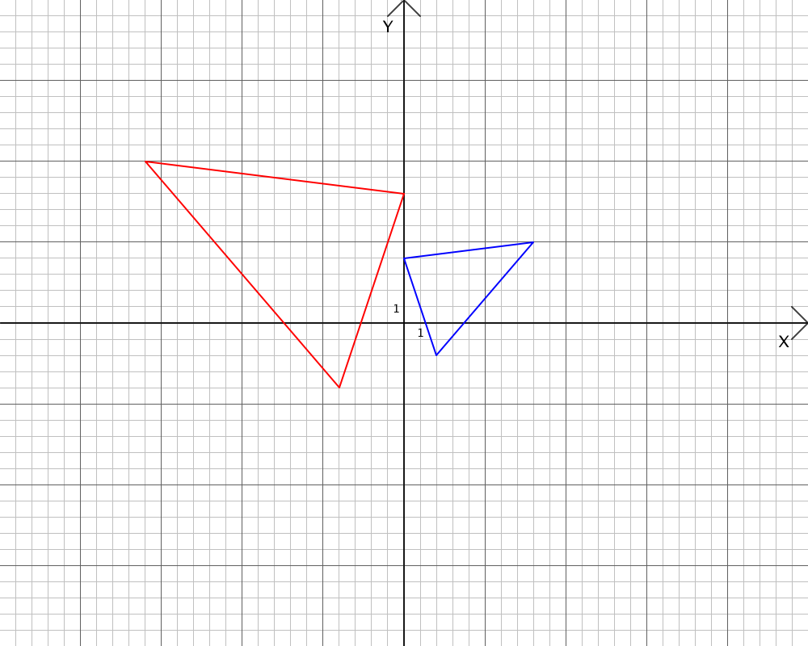
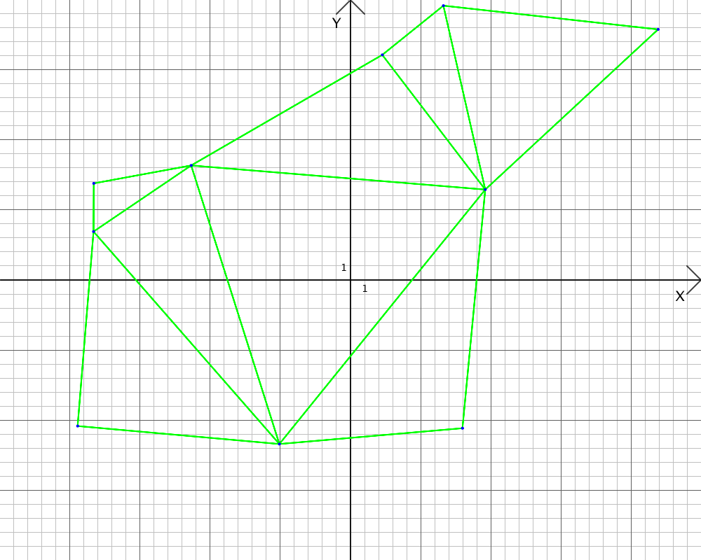
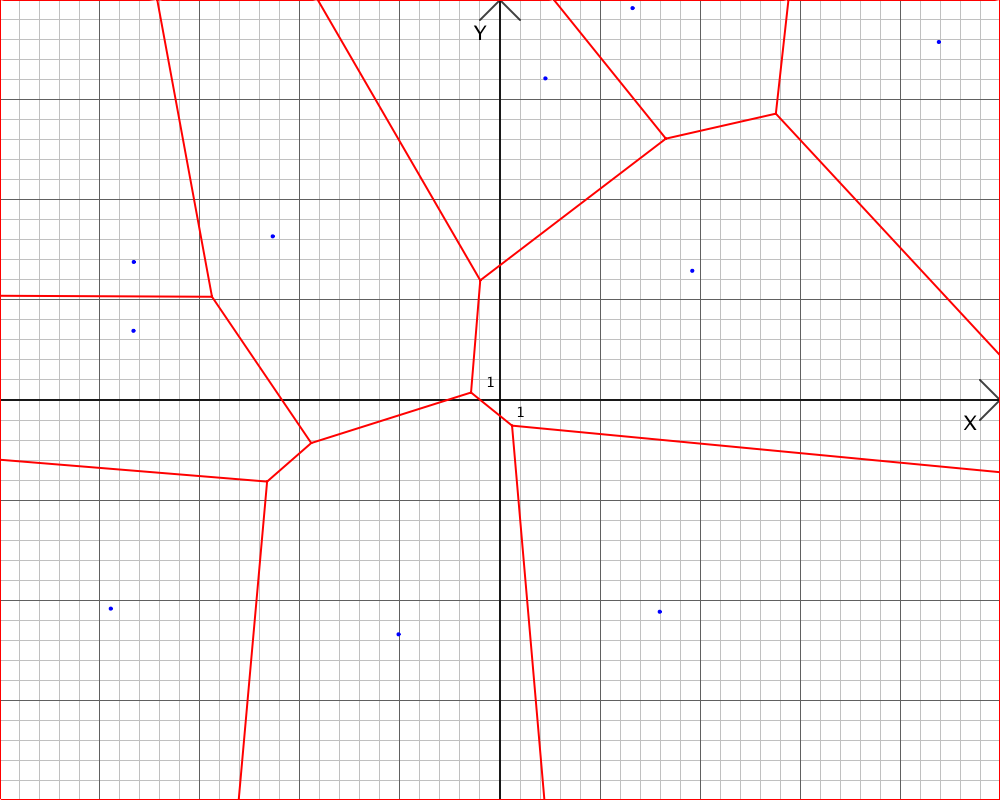

# geom
2D computational geometry written in pure Go.

## Functionality

- affine transform
- bezier curves
- drawing line with simple algorythm
- drawing line with [Bresenhamm](https://en.wikipedia.org/wiki/Bresenham%27s_line_algorithm) algorythm
- build convex hull with [Jarvis](https://en.wikipedia.org/wiki/Gift_wrapping_algorithm) algorythm
- build convex hull with [Graham](https://en.wikipedia.org/wiki/Graham_scan) algorythm
- check if point lies inside polygon with [Ray](https://en.wikipedia.org/wiki/Point_in_polygon#Ray_casting_algorithm) Method
- check if point lies inside polygon with Angle Method
- intersect polygons
- draw [Voronoi](https://en.wikipedia.org/wiki/Voronoi_diagram) diagram and [Delaunay](https://en.wikipedia.org/wiki/Delaunay_triangulation) triangulation

## Get Started

```go
package main

func main() {
    w, h, cage, scale := 1000, 800, 20, 1.0
    canvas := geom.NewCanvas(w, h, cage, scale)

    canvas.DrawLine(0, 0, 10, 10)
    canvas.SetColor(color.RGBA{255, 0, 0, 255})
    canvas.Stroke()

    if err := canvas.SavePNG("example"); err != nil {
        panic(err)
    }
}
```

check more examples at `/examples` directory

## Examples

Draw line using Bresenham algorithm


Build convex hulls, intersect polygons, check if points lies inside polygon


Draw patrik, tangent and norm vectors


Draw pretty things using bezier curves


Apply affine transforms to objects


Draw delone triangulation


Draw voronoi diagram

